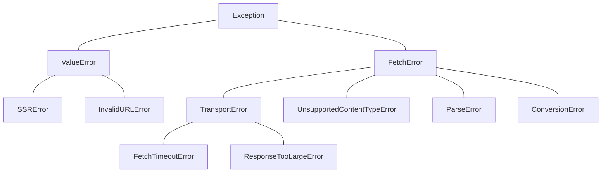

# Spec: SOLID Redesign of `src/hh_mcp/fetch.py`

- Status: **Draft / Design only** (no production code in this doc)
- Scope: redesign of the page-fetching pipeline (SSRF guard → HTTP → HTML → Markdown)
- Constraints: Python ≥3.14, `uv` only, no new primary dependencies, no linter/mypy, back-compat of `from hh_mcp.fetch import fetch_as_markdown, fetch_page, validate_url, SSRError`

---

## 1. Overview & priorities

### 1.1 Problems with the current module

| # | Problem | SOLID violation |
|---|---------|-----------------|
| P1 | `fetch_page` creates a new `httpx2.Client` per call and hardcodes `_USER_AGENT`, limits, redirect rules inside the function | **SRP** (transport + policy + request in one function), **OCP** (policy change = code change) |
| P2 | `fetch_as_markdown` (public API) hardwires markitdown, `StreamInfo`, title prefix, truncation, timeout clamp | **SRP** (orchestration mixed with conversion policy), **DIP** (orchestrator depends on the concrete `MarkItDown`) |
| P3 | `_html_to_markdown` is a private closure over markitdown — not replaceable, not unit-testable without markitdown | **OCP/DIP** |
| P4 | No noise removal (nav/aside/footer/ads), no relative-link normalization, no pre/post-processing | missing feature, requirement 2 |
| P5 | Errors: bare `ValueError` for 4 MiB cap, `httpx.HTTPStatusError` leaking from the public contract | **SRP/ISP** (error types are not a module-owned contract) |
| P6 | No logging at all; no explicit logger injection | missing requirement (i) |
| P7 | Hidden global-ish state: module constants used inside functions without a config object | requirement 3 (no global state) |

### 1.2 SOLID → component mapping

| Principle | Where satisfied |
|-----------|-----------------|
| **S — SRP** | One module = one concern: `errors.py`, `config.py`, `guards.py`, `transport.py`, `html.py`, `links.py`, `converter.py`, `orchestrator.py` |
| **O — OCP** | Extension points are Protocols/dataclasses, not code edits: `MarkdownConverter` Protocol, `FetchTransport` Protocol, `NoisePolicy`, `RequestConfig` |
| **L — LSP** | `SSRError` stays a `ValueError` subclass; any `MarkdownConverter` replacement behaves as `MarkdownConverter` (documented contract, raise `ConversionError` on failure) |
| **I — ISP** | Narrow per-component interfaces: guard returns `None|raises`; transport returns `bytes`; converter returns `MarkdownResult`; orchestrator composes |
| **D — DIP** | `orchestrator.py` depends on Protocols (`FetchTransport`, `MarkdownConverter`) and config objects, never on `httpx2`/`markitdown` classes directly; the two third-party imports are isolated into `transport.py` and `converter.py` |

### 1.3 Non-goals (out of scope for this spec)

- No `async` rework (the module stays sync; `asyncio.to_thread`-wrapping for FastMCP tool handlers is a separate concern noted in AGENTS.md).
- No browser-based fetching — `playwright` stays reserved, untouched.
- No new primary dependencies; `markitdown` stays the default (and only) converter.
- No linter/mypy configuration.

---

## 2. Layout

### 2.1 Decision: package `src/hh_mcp/fetch/` (not a single module)

- 9 components × 200+ lines each of contracts ⇒ a single file cannot hold them without re-creating P2/P1.
- `src/hh_mcp/fetch.py` is replaced by the directory package `src/hh_mcp/fetch/` with `__init__.py` **re-exporting the exact old public names** (`fetch_as_markdown`, `fetch_page`, `validate_url`, `SSRError`, plus new exports).
- `hh_mcp/__init__.py` stays as-is (docstring + `__version__` only) — the package is imported explicitly, no top-level re-export needed.
- `__main__.py`/`[project.scripts]` — not touched (unchanged open item from AGENTS.md).

### 2.2 File tree

```
src/hh_mcp/fetch/
├── __init__.py     # public API re-exports (+ __all__), thin wrappers over FetchService
├── errors.py       # exception hierarchy
├── config.py       # RequestConfig, NoisePolicy (frozen dataclasses) + default factories
├── guards.py       # SSRF guard (UrlGuard)
├── transport.py    # FetchTransport Protocol + HttpxTransport (+ build helpers)
├── links.py        # resolve_relative_links (stdlib urllib)
├── html.py         # Sanitizer, TitleExtractor (stdlib html.parser), sanitize_document()
├── converter.py    # MarkdownConverter Protocol, MarkdownResult, MarkItDownConverter
└── orchestrator.py # FetchService + raw fetch_as_markdown / fetch_page entry helpers
```

| File | Role | Imports 3rd-party? |
|------|------|--------------------|
| `errors.py` | exception contract | no |
| `config.py` | configuration + noise policy + immutable defaults | no |
| `guards.py` | URL validation only (uses `httpx2.URL` for parsing) | `httpx2` (URL object only) |
| `transport.py` | HTTP client, byte cap, redirect policy | `httpx2` |
| `links.py` | relative→absolute link resolution | no (`urllib`) |
| `html.py` | HTML parse/clean (noise, scripts/styles, title) | no (`html.parser`) |
| `converter.py` | Markdown conversion abstraction + default impl | `markitdown` |
| `orchestrator.py` | composition, public API, logging | `errors`, `config` only |

**Dependency rule (DIP):** `orchestrator.py` imports no `httpx2`/`markitdown`. Tests of the orchestrator run with zero network and zero markitdown.

---

## 3. Component contracts

> Conventions: `from __future__ import annotations`; `X | None`; double quotes; numpydoc EN docstrings with `Args/Returns/Raises`; `__all__` per module; SCREAMING_SNAKE constants; underscores in numerics (`120_000`). Signature sketches below are contracts, not implementation.

### 3.1 `errors.py`

```
__all__ = ["FetchError", "SSRError", "InvalidURLError", "TransportError",
           "ResponseTooLargeError", "UnsupportedContentTypeError",
           "ParseError", "ConversionError", "FetchTimeoutError"]

class FetchError(Exception)
class SSRError(ValueError)            # back-compat: MUST remain ValueError subclass
class InvalidURLError(ValueError)
class TransportError(FetchError)      # wraps httpx2 exceptions (str(exc) kept)
class FetchTimeoutError(TransportError)
class ResponseTooLargeError(TransportError)
class UnsupportedContentTypeError(FetchError)
class ParseError(FetchError)
class ConversionError(FetchError)
```

- `SSRError` is **not** under `FetchError` (historical reason: it is a `ValueError` and a client/config error, not a fetch failure). Callers may catch either.
- `TransportError`/`ConversionError` carry `__cause__` set via `raise ... from exc` (preserve original traceback context).
- `InvalidURLError` is raised for non-string/empty/absent-scheme URLs at the API boundary (distinct from `SSRError` which is a *security* rejection).

### 3.2 `config.py`

```
DEFAULT_USER_AGENT = f"hh-mcp/{__version__}"   # "hh-mcp/0.1.0"
DEFAULT_TIMEOUT = 30.0
DEFAULT_MAX_BODY_BYTES = 4 * 1024 * 1024        # 4 MiB
DEFAULT_MAX_REDIRECTS = 10
DEFAULT_MAX_CONNECTIONS = 10
DEFAULT_MAX_KEEPALIVE = 5
PUBLIC_MIN_TIMEOUT = 1.0
PUBLIC_MAX_TIMEOUT = 120.0
PUBLIC_DEFAULT_MAX_CHARS = 120_000
MIN_TIMEOUT = 0.001
MAX_TIMEOUT = 300.0

@dataclass(frozen=True, slots=True)
class NoisePolicy:
    """Elements/attributes the Sanitizer removes as boilerplate."""
    remove_elements: frozenset[str] = frozenset({
        "nav", "aside", "footer", "header", "form",
        "script", "style", "iframe", "noscript", "svg",
        "button", "input", "select", "textarea",
    })
    remove_classes: frozenset[str] = frozenset({
        "hidden", "ads", "advertisement",
    })
    remove_attrs_prefix: frozenset[str] = frozenset({"data-ad"})

    def is_noise(self, tag: str, attrs: Mapping[str, str | None]) -> bool: ...

@dataclass(frozen=True, slots=True)
class RequestConfig:
    user_agent: str = DEFAULT_USER_AGENT
    timeout: float = DEFAULT_TIMEOUT
    max_body_bytes: int = DEFAULT_MAX_BODY_BYTES
    max_redirects: int = DEFAULT_MAX_REDIRECTS
    max_connections: int = DEFAULT_MAX_CONNECTIONS
    max_keepalive: int = DEFAULT_MAX_KEEPALIVE
    verify_tls: bool = True
    noise: NoisePolicy = NoisePolicy()

    def __post_init__(self) -> None:
        # strict validation, ValueError with field names:
        # 0 < timeout <= MAX_TIMEOUT
        # 0 < max_body_bytes <= 64 MiB
        # 0 <= max_redirects <= 20 ; 0 < max_connections, max_keepalive <= max_connections
        # user_agent non-empty
        ...

def default_config() -> RequestConfig: ...
def default_noise_policy() -> NoisePolicy: ...
```

- `frozen=True, slots=True` everywhere; no mutable state, no singletons (factories are plain functions).
- Frozen dataclass validation has to use `object.__setattr__` if any default rewriting is needed (expected: not needed — validate only, raise on bad).
- `str(cfg)` is not part of the contract (loggers log fields explicitly, no `repr` of secrets).

### 3.3 `guards.py`

```
class UrlGuard:
    """SSRF guard. Stateless; constructed with no args."""
    def validate(self, url: str) -> str:
        """Return a normalized absolute http(s) URL.

        Raises:
            InvalidURLError: not a str / empty / no scheme / unparseable.
            SSRError: non-http(s) scheme, userinfo in URL, empty host,
                host ends with 'localhost' / '.localhost' / '.local'.
        """

def validate_url(url: str) -> None:   # back-compat shim, re-exported in __init__
    """Same behavior as today: raises SSRError on violation, returns None."""
    UrlGuard().validate(url)
```

- Parse with `httpx2.URL` (already a dependency; no stdlib round-trip needed).
- Behavior preserved exactly: same 5 rejection rules, same `SSRError` messages (see §8).
- `validate` additionally raises `InvalidURLError` for non-string input (new, but public shim keeps `SSRError` for anything `httpx.URL` would parse).

### 3.4 `transport.py`

```
class FetchTransport(Protocol):
    """One-shot fetch of a URL to raw bytes."""
    def fetch(self, url: str, *, config: RequestConfig) -> bytes: ...

class HttpxTransport:
    """httpx2-based default. No pool reuse across calls (per-request Client),
    same trade-off as today but parameters come from RequestConfig."""
    def __init__(self, *, config: RequestConfig, logger: logging.Logger) -> None: ...
    def fetch(self, url: str, *, config: RequestConfig | None = None) -> bytes: ...
        # - builds httpx2.Client(http2=True, follow_redirects, max_redirects,
        #   timeout=config.timeout, limits=..., headers={User-Agent})
        # - GET, raise_for_status, read()
        # - len(content) > max_body_bytes -> ResponseTooLargeError (4 MiB default)
        # - httpx2 locales: content-type check optional (see §10)
        # - httpx2.TimeoutException -> FetchTimeoutError
        #   httpx2.HTTPStatusError / TransportError / RequestError -> TransportError
        # - DEBUG log: host, status, bytes, duration; NEVER body, headers

def default_transport(config: RequestConfig, logger: logging.Logger) -> FetchTransport: ...
```

- `FetchTransport` is the abstraction `orchestrator.py` uses (DIP).
- `SerializeError-free`: only `bytes` out; decoding is the converter's concern.

### 3.5 `links.py`

```
def resolve_relative_links(html: str, base_url: str) -> str:
    """Rewrite a[href] / img[src] / source[src] / link[href] to absolute URLs
    against base_url (urllib.parse.urljoin). Returns the rewritten document.
    No I/O, no parsing into a tree — textual operation using stdlib
    html.parser with a small inline handler that collects (start, end, attr)
    spans. Idempotent for already-absolute hrefs."""
```

- Pure function → trivially unit-testable (relative, protocol-relative, hash, empty, already-absolute, percent-encoding).
- Called **once**, inside `sanitize_document`, before the converter runs.

### 3.6 `html.py`

```
@dataclass(frozen=True, slots=True)
class SanitizedDocument:
    html: str          # cleaned UTF-8 text, links already absolute
    title: str | None  # from <title> (primary)
    removed: int       # count of removed noise nodes (for DEBUG log)

class Sanitizer:
    """Stdlib html.parser-based cleaner. Lenient by construction:
    malformed HTML never raises, it is parsed as best-effort."""
    def __init__(self, *, noise: NoisePolicy, logger: logging.Logger) -> None: ...
    def sanitize(self, html: str, *, base_url: str | None = None) -> SanitizedDocument:
        # 1. drop <script>/<style> subtrees (script: always, style: always)
        # 2. drop nodes matching noise.is_noise(...)
        # 3. resolve relative links when base_url is given
        # 4. extract <title> first occurrence (stripped, None if absent)
        # 5. DEBUG log: removed count

def SanitizedDocument.empty() -> SanitizedDocument: ...  # Safe empty path

def sanitize_document(html: str, *, base_url: str | None, config: RequestConfig, logger: logging.Logger) -> SanitizedDocument: ...
```

- Why stdlib `html.parser` instead of bs4/lxml: (a) bs4 is **not** a top-level dependency of our project — it is a transitive dep of markitdown; depending on it directly would risk a future markitdown version pin change; (b) we only need *removal + attribute rewrite*, which a single-pass `HTMLParser` with a suppression stack does without building a full tree; (c) zero new deps per task constraint 6; (d) `html.parser` is lenient on malformed input (never raises on unterminated tags) — which is exactly the robustness requirement for "некорректный HTML".
- Parsing errors never propagate as `ParseError`: the contract is "best effort, never fail on markup". `ParseError` exists (see §4) for the *decode* stage only (invalid UTF-8 bytes → `ParseError`, back-compat: old code raised nothing here since markitdown decoded; new code must not start failing where old code did — see §8 note).

### 3.7 `converter.py`

```
@dataclass(frozen=True, slots=True)
class MarkdownResult:
    markdown: str
    title: str | None = None

class MarkdownConverter(Protocol):
    """Convert a clean HTML document to Markdown. Implementations MUST
    return MarkdownResult, MUST raise ConversionError on failure,
    MUST NOT do I/O."""
    def convert(self, html: str, *, base_url: str | None) -> MarkdownResult: ...

class MarkItDownConverter:
    """Default converter wrapping markitdown.MarkItDown (isolated import)."""
    def __init__(self, *, loggers: logging.Logger) -> None: ...
    def convert(self, html: str, *, base_url: str | None) -> MarkdownResult:
        # markitdown.convert_stream(BytesIO(html.encode()), StreamInfo(mimetype="text/html",
        #   extension=".html", charset="utf-8", url=base_url or None))
        # -> DocumentConverterResult(markdown, title)
        # markitdown.MarkItDownException/OSError/recursion -> ConversionError
        # markitdown RecursionError fallback warning is forwarded as DEBUG log
        # Re-raises nothing else.

def default_converter(logger: logging.Logger) -> MarkdownConverter:
    return MarkItDownConverter(logger=logger)
```

- The only module that imports `markitdown` (version lock / upgrade point is here, per AGENTS.md note about `markitdown` 4.x-era API).
- Note from code inspection: markitdown's own `HtmlConverter` does **not** normalize `href` against the stream URL (its `url` is only a fallback for source resolution). Therefore relative-link normalization lives in `links.py`, **before** conversion — this is the design decision of §2 (converter contract keeps a `base_url` param for future converters that want it).

### 3.8 `orchestrator.py`

```
class FetchService:
    __all__ = ["FetchService"]
    def __init__(
        self,
        *,
        config: RequestConfig,
        transport: FetchTransport,
        converter: MarkdownConverter,
        guard: UrlGuard = UrlGuard(),
        logger: logging.Logger,
    ) -> None: ...

    def fetch_page(self, url: str, *, timeout: float | None = None) -> bytes:
        # validate -> transport.fetch(url, config=cfg with optional timeout override)

    def fetch_as_markdown(
        self, url: str, *, timeout: int | float | None = None,
        max_chars: int = PUBLIC_DEFAULT_MAX_CHARS,
    ) -> str:
        # 1. timeout clamping: clamp to [PUBLIC_MIN_TIMEOUT, PUBLIC_MAX_TIMEOUT] (120)
        # 2. html_bytes = guard.validate(url); transport.fetch(...)
        # 3. decode: declared charset from response? (old code: utf-8 via markitdown)
        #    -> use response-independent utf-8 with utf-8-sig strip; on UnicodeDecodeError
        #       -> keep bytes and let converter fail with ConversionError (same as today)
        # 4. sanitized = Sanitizer(cfg.noise).sanitize(html, base_url=url)
        # 5. result = converter.convert(sanitized.html, base_url=url)
        # 6. title = sanitized.title or result.title
        # 7. out = f"# {title}\n\n{md}" if title else md
        # 8. if len(out) > max_chars: out = out[:max_chars] + "\n\n...truncated..."
        # 9. return out

    def html_to_markdown(
        self, html: bytes | str, *, base_url: str | None = None,
        max_chars: int | None = None,
    ) -> str:
        """NEW: requirement 2(2). No network. str is utf-8; bytes are utf-8
        (decode error -> ParseError). base_url drives link resolution.
        max_chars omitted -> no truncation (pure conversion path)."""

def fetch_as_markdown(url, *, timeout=30, max_chars=120_000,
                      config=None, transport=None, converter=None,
                      guard=None, logger=None) -> str:
    """Public API, back-compat signature + optional DI tail (all None-defaults).
    None -> module defaults from config.py (lazy, per-call; no caching anywhere)."""

def fetch_page(url, *, timeout=30.0, config=None, transport=None, logger=None) -> bytes: ...
def validate_url(url: str) -> None: ...   # re-export of guards.validate_url
```

- Default DI objects are created **per call** by plain functions (`default_config()`, `default_transport`, `default_converter`) — no module-level singletons, no cached global client (documented trade-off vs perf in §10; transport pooling is out of scope here).
- `html_to_markdown` is the explicit second capability the module must expose (HTML text/bytes → clean Markdown without a URL).

### 3.9 `__init__.py` of the package

```
"""fetch-h response handling for the hh-mcp server."""
from .errors import FetchError, SSRError, ...  (full set)
from .config import RequestConfig, NoisePolicy
from .guards import validate_url
from .orchestrator import fetch_as_markdown, fetch_page, html_to_markdown, FetchService

__all__ = [
    "fetch_as_markdown", "fetch_page", "html_to_markdown", "validate_url",
    "SSRError", "FetchError", "InvalidURLError", "TransportError",
    "ResponseTooLargeError", "UnsupportedContentTypeError", "ParseError",
    "ConversionError", "FetchTimeoutError",
    "RequestConfig", "NoisePolicy", "FetchService",
]
```

---

## 4. Error hierarchy

```
Exception
├── ValueError
│   ├── SSRError                      # security (unchanged base — LSP)
│   └── InvalidURLError               # malformed address (new)
└── FetchError                        # new: umbrella of fetch-stage failures
    ├── TransportError                # network/HTTP (wraps httpx2)
    │   ├── FetchTimeoutError
    │   └── ResponseTooLargeError     # 4 MiB cap (was: ValueError)
    ├── UnsupportedContentTypeError   # non-HTML content-type (new)
    ├── ParseError                    # decode / pre-parse failure
    └── ConversionError               # converter failure (wraps markitdown)
```



Callers:
- old code that did `except ValueError as e` around `fetch_as_markdown` still catches `SSRError` **and** `InvalidURLError`; it will no longer catch the 4 MiB case (now `ResponseTooLargeError` ⊂ `FetchError`) — documented as intentional in §8.
- MCP tool layer (future) catches `FetchError` for user-facing errors, `ValueError` for input errors — clean split.

---

## 5. Configuration

- `RequestConfig` / `NoisePolicy`: `@dataclass(frozen=True, slots=True)` — immutable, hashable, no `__weakref__`, cheap allocation; fits "no global state" (every call holds its own).
- Defaults come from module constants (`config.py`), **not** baked into dataclass field initializers except via those constants — single source of truth.
- Validation in `__post_init__`: raise `ValueError("<field>: <reason>")` (input validation is a caller error, not `FetchError`).
- `ToString`: no custom `__str__`; logging prints selected fields only (UA, host, timeout) — avoid accidental PII in logs.

## 6. Logging

- Logger name: `hh_mcp.fetch` (module root); sub-loggers via `logger.getChild("transport")`, `("sanitize")`, `("convert")`.
- `logging.getLogger("hh_mcp.fetch")` — never `basicConfig`, never `print` (stdout is MCP JSON-RPC per AGENTS.md; handlers go to stderr by consumer configuration).
- Levels contract:
  - `DEBUG`: request start (host, method, UA), response (status, byte size, elapsed ms, redirect count), sanitize stats (removed nodes), conversion duration. **Never** bodies, HTML, or full headers.
  - `WARNING`: markitdown RecursionError fallback, non-HTML content-type accepted, TLS verification disabled via config.
  - `ERROR`: conversion failure with exception class name (no HTML payload).
- Logger is injected: `FetchService(logger=...)`; default is `logging.getLogger("hh_mcp.fetch")` created by `default_logger()` factory in `orchestrator.py` (function, not module singleton with state).
- Structured fields via extra: `msg = "fetch ok", extra={"host": h, "status": s, "bytes": n, "elapsed_ms": e}` — consumer can format.
- No log-MUST in back-compat path: existing callers who never configured logging see nothing (root logger default level) — behavior identical to today.

## 7. Markdown converter

- Protocol `MarkdownConverter.convert(html: str, *, base_url: str | None) -> MarkdownResult` (§3.7) — the user-requested `bytes` input form is covered by `orchestrator.html_to_markdown(html: bytes | str)` which decodes once and passes `str` to every converter (decoding is the orchestrator's stable concern; converters never see ambiguous bytes).
- `MarkItDownConverter` is the default; swap-in path (future: `markdownify` direct, playwright-based renderer) = implement Protocol + factory in `config.py` or user code. No markitdown import outside `converter.py`.
- `markitdown` pin: `uv.lock` is the version authority (AGENTS.md); upgrade touches only `converter.py` + this spec's §3.7.

## 8. Back-compat matrix

| Aspect | Old | New | Status |
|--------|-----|-----|--------|
| `from hh_mcp.fetch import fetch_as_markdown, fetch_page, validate_url, SSRError` | works | works (package re-exports) | **identical** |
| `fetch_as_markdown(url, *, timeout=30, max_chars=120_000)` signature | int timeout | int timeout (still int in public) | **identical** |
| timeout >120 → clamped to 120 | yes | yes (inside service) | **identical** |
| output prefix `# <title>\n\n` | yes (title from markitdown) | yes (title from sanitizer, fallback to converter) | **output-identical** (same page → same title) |
| truncation `...truncated...` suffix, cut at `max_chars` | yes | yes (same expression) | **identical** |
| `fetch_page(url, *, timeout=30.0) -> bytes` | raw bytes | raw bytes | **identical** |
| 10 redirects, http2, gzip auto-decompress, 4 MiB cap, `raise_for_status` | yes | yes | **identical behavior** |
| type of 4 MiB error | `ValueError` | `ResponseTooLargeError` (⊂ `FetchError`, **not** `ValueError`) | **changed** (deliberate; see open question OQ1) |
| `validate_url` raises `SSRError` (⊂ `ValueError`) on: non-http(s), userinfo, empty host, localhost/.localhost/.local | yes | yes, same 5 rules, same messages | **identical** |
| `httpx.HTTPStatusError` on 4xx/5xx | yes | re-raised as `TransportError` (⊂ `FetchError`; `__cause__` = original `httpx.HTTPStatusError`) | **changed** (catch `FetchError` or `TransportError` now; `exc.__cause__` preserves original) |
| `fetch_as_markdown` on non-2xx | propagates `httpx.HTTPStatusError` | raises `TransportError` (wraps) | **changed** (pairs with row above) |
| module-global constants `_USER_AGENT`, `_MAX_HTML_BYTES` | private names | public `RequestConfig` fields with same values (UA via `__version__`) | **new** (old names removed from `__all__`; they were never public) |
| empty/absent title | no prefix | no prefix | **identical** |
| empty HTML page | returns `""` (markitdown) | returns `""` | **identical** |

**What is signed-identical:** all import names, all public signatures' positional/keyword shape, all success-path outputs (bytes / markdown text), SSRF behavior, redirect/size/timeout budget. **What is new/intentionally changed:** exception taxonomy (4 MiB + HTTP-status now under `FetchError`), DI parameters (every public fn accepts optional `config/transport/converter/guard/logger` kwargs, all defaulted), `html_to_markdown`, `RequestConfig/NoisePolicy`, `FetchService`, link normalization + noise removal (output grows cleaner — *new feature*, not a compat break), `unsupported content-type` now a first-class error.

## 9. Test plan (components → cases; tests themselves written by another agent)

| Component | Cases | No network? | No markitdown? |
|-----------|-------|-------------|----------------|
| `guards.validate_url` | http/https ok; `ftp://` → SSRError; `https://user:pw@x/` → SSRError; empty host; `https://localhost/x`, `https://a.localhost`, `https://a.local` → SSRError; `https://LOCALHOST` case-insensitive; non-str input → InvalidURLError | yes | yes |
| `links.resolve_relative_links` | `/page` → base path; `a/b` → base dir join; `../x`; `http://abs` unchanged; `//host` protocol-relative; `#frag`; `?query`; percent-encoding roundtrip; no `a` tags → unchanged; malformed HTML (no crash) | yes | yes |
| `html.Sanitizer` | removes nav/aside/footer/form/iframe; class="hidden"/"ads"; keeps `<main>`/`<article>` content; nested noise removed; `<script>`/`<style>` stripped (incl. with content); title extraction (first, stripped, None when absent, and ` и кириллица`); empty document → `SanitizedDocument.empty`-like; malformed HTML (unclosed tags, stray `<`) → no raise; 1 MiB doc → ok | yes | yes |
| `converter.MarkItDownConverter` | headings h1-h3; ordered/unordered incl. nested lists; tables (thead/tbody, pipes); links with titles; images (alt text); `pre`/`code` with language hint (`class="language-python"`); `blockquote`; bold/italic/strikethrough/inline code; Cyrillic entities `&#1080;` and raw UTF-8; `<title>` → `result.title`; empty html → `""`; deeply-nested (RecursionError route → returned as plain text, not raised); garbage bytes input → `ConversionError` | yes | **no** (real markitdown; acceptable as 1 component) |
| `converter` (Protocol) | fake converter object (no markitdown) satisfies `FetchService`; custom converter title fallback ordering; converter raising `ConversionError` propagates | yes | yes |
| `transport.HttpxTransport` | `httpx2.MockTransport` handler: 200 → bytes; 200 + body 4 MiB+1 → `ResponseTooLargeError`; 404/500 → `TransportError` (with `__cause__`); `TooManyRedirects` (mock 11 redirects) → `TransportError`; timeout (mock raising `ReadTimeout`) → `FetchTimeoutError`; `http2=True` flag passed (assert via mock client kwargs); UA header present; per-call client (no shared pool) | **no** (MockTransport) | yes |
| `orchestrator.fetch_as_markdown` | end-to-end with MockTransport + fake converter: title prefix; truncation boundary (`max_chars` exact, +1, 0); timeout clamp (30→30, 2000→120, 0→1.0? see OQ3); relative links resolved in result; noise stripped; custom `converter=` used; custom `transport=` used; `fetch_page` pass-through bytes | **no** | yes |
| `orchestrator.html_to_markdown` | str input utf-8; bytes input utf-8; `bytes` invalid utf-8 → `ParseError`; `base_url=None` → relative links left as-is; `base_url` set → resolved; `max_chars=None` → no truncation; `max_chars=5` → truncated; empty str → `""` | no | yes |
| config | `RequestConfig()` defaults equal documented constants; bad timeout (0, -1, 1000) → ValueError with field name; `NoisePolicy` immutability (`policy.remove_elements += ...` raises); `slots` (setting unknown attr raises) | yes | yes |
| logging | caplog: DEBUG has host/status/bytes; no HTML body ever in any record; no `print` to stdout (assert on `capsys`) | yes | yes |
| regression (golden) | old `fetch_as_markdown` output for a fixed sample doc equals new output (modulo now-removed noise — captured diff as a fixture) | no (mocked) | yes |

## 10. Risks & open questions

- **R1 (resolved in design):** bs4 is a *transitive* dependency via markitdown — we must **not** import it directly from our package (version-pinning risk). Stdlib `html.parser` chosen (§3.6); if a future requirement needs true DOM manipulation (e.g. reorder, restructure), we re-evaluate and document a `bs4[html5lib]` add via `uv add` (would need a spec amendment, not an edit).
- **R2:** markitdown 4.x API is in flux (preview); `MarkItDownConverter` is the blast radius — keep it thin (one method, no internal reuse of markitdown internals).
- **R3:** `html.parser` happy-path performance on 4 MiB documents: single pass, no DOM — acceptable; if profiling shows issues, the mitigation is a content-length pre-check *before* sanitize (already have the byte cap).
- **R4 (OQ1):** 4 MiB error becomes `ResponseTooLargeError(FetchError)`, no longer `ValueError`. Callers doing `except ValueError` lose that case. Presumably none exist (one module, no other code in repo). Decision: accept, document in §8.
- **OQ2:** should `fetch_page` expose a `content_type` in a new return (e.g. bytes → `FetchedPage` object)? Chosen: **no** — signature stays `bytes` for back-compat; content-type check is optional and off by default (warn + proceed as today's `text/html` assumption via markitdown).
- **OQ3:** public `timeout: int` vs `int | float`: keep `int` in public signatures (back-compat), coerce to float inside service; clamp range decided `[1.0, 120.0]` — old behavior clamped only the upper bound; `timeout=0` → become `FetchTimeoutError` at transport? Both behaviors are "fail"; decision: `timeout <= 0` is silently set to `PUBLIC_MIN_TIMEOUT` (documented) to avoid a new exception class in the public path.
- **Open:** `__main__.py` / `[project.scripts]` entry point (separate task per AGENTS.md — untouched here).
- **Open:** async wrapper (`asyncio.to_thread`) for FastMCP — out of scope; noted for the tool-layer spec.
- **Trade-off:** no shared/pooled HTTP client across calls (same as today's per-call `Client`). Perf is comparable to current; pooling would need a longer-lived handle (state) which conflicts with "no global state" unless the MCP tool owner passes a service instance — accepted.
