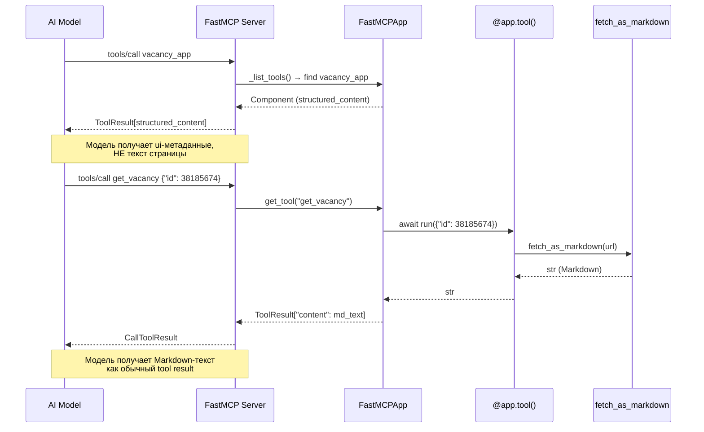
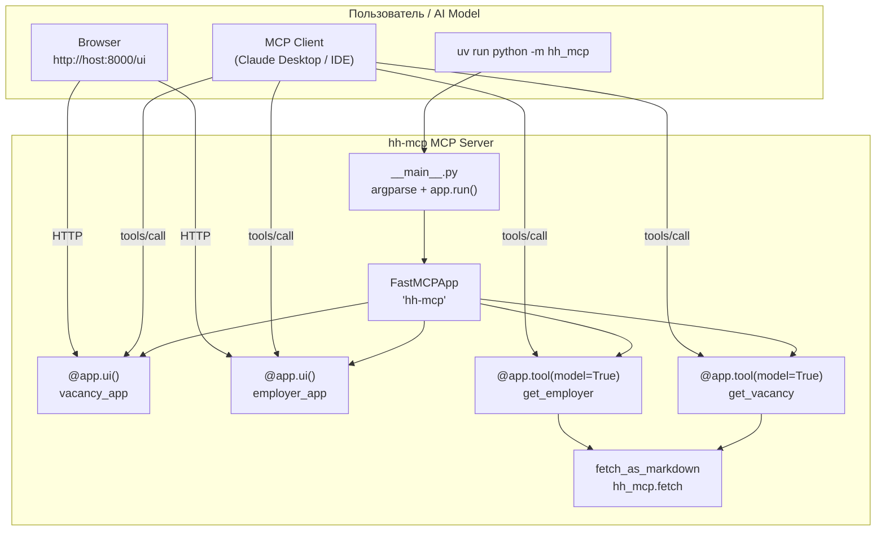

# FastMCP Apps → hh-mcp: Architecture & Implementation Plan

> **Исторический план (реализация отклонилась).** Документ описывает вариант с
> отдельными `@app.ui()`-панелями. Фактически сделано проще: инструментов три
> (`vacancy`, `company`, `search`), каждый работает и для модели, и для браузера
> — через `register_tool()` с маркером `ui://prefab/renderer.html` в
> `meta["ui"]`. Актуальное устройство — в [`apps_mode.md`](apps_mode.md) §1.1
> и в [`src/hh_mcp/app.py`](../src/hh_mcp/app.py). Имена ниже оставлены как
> были на момент плана.

## 1. Резюме

Добавить в `hh-mcp` MCP-сервер, работающий по **FastMCP Apps**-паттерну:
два эндпоинта (`vacancy`, `employer`) — каждый одновременно доступен как
**MCP-инструмент для AI-модели** и как **интерактивная UI-панель в браузере**.

**Ключевое решение:** использовать `FastMCPApp` (Provider-композиция) вместо
прямого `FastMCP`, что даёт разделение на entry-point (`@app.ui()`) и backend
(`@app.tool(model=True)`) с автоматической Prefab-рендеринг-инфраструктурой.

---

## 2. Модульная структура

```
src/hh_mcp/
├── __init__.py            # существует
├── __main__.py            # НОВЫЙ — entry point: парсинг флагов, запуск
├── app.py                 # НОВЫЙ — FastMCPApp + @app.ui() / @app.tool()
└── fetch/
    ├── __init__.py        # существует
    ├── orchestrator.py    # существует — fetch_as_markdown(url, …)
    └── ...                # остальные модули без изменений
```

### 2.1. `src/hh_mcp/app.py` — FastMCPApp + инструменты

```python
"""MCP Apps — интерактивные инструменты hh.ru."""

from __future__ import annotations

from fastmcp import FastMCPApp
from prefab_ui.actions import ShowToast
from prefab_ui.actions.mcp import CallTool
from prefab_ui.components import (
    Badge,
    Button,
    Card,
    CardContent,
    Column,
    Heading,
    Input,
    Separator,
    Text,
)

from hh_mcp.fetch import fetch_as_markdown, SSRError, FetchError

app = FastMCPApp("hh-mcp")
```

#### 2.1.1. Backend-инструменты — `@app.tool(model=True)`

Оба инструмента — синхронные функции. FastMCP по умолчанию
(`run_in_thread=True`) диспатчит их в thread-pool, не блокируя event loop.

```python
@app.tool(model=True)          # видимость: ["app", "model"]
def get_vacancy(id: int) -> str:
    """Получить содержимое страницы вакансии hh.ru в формате Markdown.

    Args:
        id: Числовой идентификатор вакансии (например, 38185674).
    """
    url = f"https://hh.ru/vacancy/{id}"
    try:
        return fetch_as_markdown(url)
    except SSRError:
        raise ToolError("SSRF guard rejected the URL")
    except FetchError as e:
        raise ToolError(str(e))


@app.tool(model=True)
def get_employer(id: int) -> str:
    """Получить содержимое страницы компании-работодателя hh.ru в Markdown.

    Args:
        id: Числовой идентификатор работодателя (например, 9410116).
    """
    url = f"https://hh.ru/employer/{id}"
    try:
        return fetch_as_markdown(url)
    except SSRError:
        raise ToolError("SSRF guard rejected the URL")
    except FetchError as e:
        raise ToolError(str(e))
```

**Тип параметра:** `int` (а не `str`) — semantic validation на уровне JSON Schema.
Модель-клиент получит `{"id": {"type": "integer"}}` и не сможет передать
произвольную строку.

#### 2.1.2. UI-инструменты — `@app.ui()`

```python
@app.ui()
def vacancy_app() -> Column:
    """Посмотреть вакансию hh.ru."""
    id_input = Input(placeholder="ID вакансии…", name="vacancy_id")
    return Column(
        gap=4,
        css_class="p-6 max-w-3xl mx-auto",
        children=[
            Heading("Просмотр вакансии"),
            Text("Введите числовой ID вакансии и нажмите кнопку."),
            id_input,
            Button(
                "Получить вакансию",
                variant="default",
                on_click=CallTool(
                    tool="get_vacancy",
                    arguments={"id": "{{ vacancy_id }}"},
                    on_success=ShowToast("Готово", variant="success"),
                    on_error=ShowToast("Ошибка", variant="error"),
                ),
            ),
            # Результат будет показан через структурированный контент
            # платформы — дополнительный Text-блок не требуется.
        ],
    )


@app.ui()
def employer_app() -> Column:
    """Посмотреть компанию-работодателя на hh.ru."""
    id_input = Input(placeholder="ID работодателя…", name="employer_id")
    return Column(
        gap=4,
        css_class="p-6 max-w-3xl mx-auto",
        children=[
            Heading("Просмотр работодателя"),
            Text("Введите числовой ID компании и нажмите кнопку."),
            id_input,
            Button(
                "Получить информацию",
                variant="default",
                on_click=CallTool(
                    tool="get_employer",
                    arguments={"id": "{{ employer_id }}"},
                    on_success=ShowToast("Готово", variant="success"),
                    on_error=ShowToast("Ошибка", variant="error"),
                ),
            ),
        ],
    )
```

### 2.2. `src/hh_mcp/__main__.py` — точка входа

```python
"""hh-mcp MCP server — entry point."""

from __future__ import annotations

import argparse

from hh_mcp.app import app


def main() -> None:
    parser = argparse.ArgumentParser(description="hh-mcp MCP server")
    parser.add_argument(
        "--transport",
        choices=["stdio", "http", "sse", "streamable-http"],
        default=None,
        help="Transport protocol (default: stdio, from settings)",
    )
    parser.add_argument("--host", default="127.0.0.1", help="HTTP bind host")
    parser.add_argument("--port", type=int, default=8000, help="HTTP bind port")
    args = parser.parse_args()

    app.run(
        transport=args.transport,
        host=args.host,
        port=args.port,
    )


if __name__ == "__main__":
    main()
```

Также добавить `[project.scripts]` в `pyproject.toml`:

```toml
[project.scripts]
hh-mcp = "hh_mcp.__main__:main"
```

---

## 3. Contract FastMCPApp

### 3.1. Иерархия сущностей

```
FastMCPApp (Provider)
  ├── @app.ui()              → entry-point tool, visibility=["model"],
  │                            resource_uri=PREFAB_RENDERER_URI,
  │                            возвращает prefab Component
  │                            (на стороне модели — structured_content
  │                             с ui-метаданными, модель НЕ видит
  │                             возвращаемый компонент как текст)
  │
  └── @app.tool(model=True)  → backend tool, visibility=["app","model"],
                               meta["fastmcp"]["app"] = app.name,
                               может быть sync (run_in_thread=True)
```

### 3.2. FastMCPApp.run()

Метод `FastMCPApp.run()` (строка 440 `app.py`) **создаёт временный `FastMCP`**:

```python
def run(self, transport=None, **kwargs):
    server = FastMCP(self.name)
    server.add_provider(self)
    server.run(transport=transport, **kwargs)
```

Параметры `**kwargs` пробрасываются в `FastMCP.run()`, который поддерживает
`host`/`port` для HTTP-транспорта.

### 3.3. Жизненный цикл запроса (sequence)



### 3.4. Важный нюанс: `@app.ui()` возвращает Component, НО модель видит не текст

Когда модель вызывает `vacancy_app()`, она получает **structured_content**
с UI-метаданными (а не Markdown-текст вакансии). Текст страницы модель
получает только вызовом `get_vacancy(id)`. Это корректное поведение
FastMCP Apps: `@app.ui()` — entry-point для UI, `@app.tool(model=True)` —
для данных.

---

## 4. Обработка ошибок (error mapping)

| Исключение fetch | Преобразование в tool | Сообщение |
|---|---|---|
| `SSRError` | `ToolError("SSRF guard rejected the URL")` | SSRF-проверка |
| `InvalidURLError` | `ToolError(f"Invalid URL: {msg}")` | Невалидный URL |
| `FetchTimeoutError` | `ToolError(f"Timeout after {timeout}s")` | Таймаут |
| `TransportError` | `ToolError(f"Transport error: {msg}")` | HTTP-ошибка |
| `ResponseTooLargeError` | `ToolError(f"Response too large > {max_chars}")` | Превышение |
| `ParseError` / `ConversionError` | `ToolError(f"Parse error: {msg}")` | Парсинг |

`ToolError` импортируется из `fastmcp.exceptions.ToolError`.

Если инструмент не может определить ID из URL (например, ID = 0 или
отрицательный), он возвращает `ToolError(f"Invalid ID: {id}")` **до** вызова
`fetch_as_markdown`.

---

## 5. Зависимости

### 5.1. Новая зависимость: `prefab-ui`

```diff
 dependencies = [
     "fastmcp>=4.0.11",
+    "prefab-ui>=0.18.0",
     "httpx2[http2]>=0.0.1",
     …

```

Установка:
```bash
uv add 'fastmcp[apps]'
# или эквивалентно:
uv add prefab-ui
```

`fastmcp[apps]` установит `prefab-ui` и любые другие зависимости `apps`-экстры.

### 5.2. Проверка наличия

`prefab_ui` **НЕ установлен** в текущем `.venv`. Без него `FastMCPApp`
работает (не падает), но UI-ресурс не синтезируется —
`_build_resource_for_tool()` возвращает `None` и entry-point tool не получает
renderer.

---

## 6. План тестирования

### 6.1. Модульные тесты (pytest, in-memory transport)

```python
from fastmcp.client import Client
from fastmcp.client.transports.memory import FastMCPTransport


async def test_get_vacancy_calls_fetch(monkeypatch):
    """get_vacancy(id=38185674) возвращает результат fetch_as_markdown."""
    from hh_mcp.app import app

    async with Client(FastMCPTransport(app)) as client:
        result = await client.call_tool("get_vacancy", {"id": 38185674})

    assert result.is_error is False
    assert "38185674" in result.content[0].text  # заглушка


async def test_get_employer_calls_fetch(monkeypatch):
    """get_employer(id=9410116) возвращает результат fetch_as_markdown."""
    from hh_mcp.app import app

    async with Client(FastMCPTransport(app)) as client:
        result = await client.call_tool("get_employer", {"id": 9410116})

    assert result.is_error is False
    assert "9410116" in result.content[0].text
```

### 6.2. Что монкейпатчить

- `fetch_as_markdown` → возвращать фиксированную строку, напр.
  `f"# Вакансия {id}"`.
- Для SSRF-тестов: `validate_url` → `raise SSRError`.

### 6.3. Тест-кейсы

| # | Тест | Ожидание |
|---|---|---|
| 1 | `get_vacancy(id=38185674)` при успешном fetch | `result.is_error == False`, контент есть |
| 2 | `get_employer(id=9410116)` при успешном fetch | `result.is_error == False`, контент есть |
| 3 | `get_vacancy(id=0)` (невалидный ID → fallback на SSRF) | `ToolError` |
| 4 | `get_vacancy(id=-1)` | `ToolError` |
| 5 | fetch кидает `SSRError` | `ToolError("SSRF guard rejected")` |
| 6 | fetch кидает `FetchTimeoutError` | `ToolError("Timeout after …")` |
| 7 | fetch кидает `TransportError` | `ToolError("Transport error: …")` |
| 8 | `app.ui()` entry-point регистрируется как tool | `tool.name == "vacancy_app"` |
| 9 | `app.tool(model=True)` регистрируется с `visibility=["app","model"]` | meta.ui.visibility содержит model |
| 10 | In-memory transport с `FastMCPTransport(app)` | соединение успешно |

### 6.4. Pattern: UI roundtrip (опционально, integration)

Протестировать, что `@app.ui()` возвращает prefab component, который можно
сериализовать. Для полного roundtrip потребуется prefab renderer
(выходит за рамки unit-тестов).

---

## 7. Точка входа и запуск

### 7.1. Режимы запуска

```bash
# stdio (по умолчанию) — для MCP-клиентов (Claude Desktop, IDE)
uv run python -m hh_mcp

# HTTP — для UI в браузере
uv run python -m hh_mcp --transport http --port 8000
# → http://127.0.0.1:8000/ui

# Через [project.scripts] после установки:
hh-mcp --transport http --port 8000
```

### 7.2. CLI-флаги

| Флаг | Тип | Default | Описание |
|---|---|---|---|
| `--transport` | `stdio/http/sse/streamable-http` | `None` (→ settings) | Транспорт |
| `--host` | str | `127.0.0.1` | HTTP bind host |
| `--port` | int | `8000` | HTTP bind port |

---

## 8. Риски и компромиссы

### 8.1. hh.ru: антибот-защита

hh.ru активно противодействует скрейпингу. Текущий `fetch_as_markdown`
использует `httpx2` (HTTP-клиент). Возможные сценарии:

- **Блокировка по User-Agent / cookie** — httpx2 может получить 403/ captcha.
- **Playwright fallback** (зарезервирован в зависимостях) — если HTTP не сработает,
  потребуется переключение на headless browser.
- **Решение на этапе архитектуры:** инструмент должен принимать опциональный
  параметр `force_browser: bool = False`, который триггерит browser-fetch.

**Статус:** не имплементировать сейчас. Закрепить в `@app.tool()` под
`description="…"` что fetch может не сработать на некоторых страницах.

### 8.2. prefab-ui: версионность

`prefab-ui` развивается independently. Критические изменения в API компонентов
(смена сигнатуры `Column()`, переименование `ShowToast`) могут сломать UI.
**Решение:** зафиксировать `prefab-ui>=0.18.0` (минимальная версия, в которой
существуют все используемые компоненты), без верхней границы.

### 8.3. FastMCPApp.run() создаёт временный FastMCP

Метод `FastMCPApp.run()` (строка 440 `app.py`) создаёт новый экземпляр
`FastMCP` при каждом вызове. Это делает тесты чистыми (новый сервер каждый
раз), но означает, что любые внешние модификации (добавление middleware,
custom routes) должны делаться **через** `FastMCPApp` или через аргументы
`run()`.

### 8.4. sync fetch_as_markdown не async

`fetch_as_markdown` — синхронная функция. FastMCP по умолчанию
(`run_in_thread=True`) диспатчит её в thread-pool, что корректно.
**Не нужно** переписывать fetch в async — это потребует рефакторинга
всего стека (httpx2 → httpx2 async, converter, guard).

### 8.5. `@app.ui()` НЕ возвращает текст для модели

Когда модель вызывает `vacancy_app()`, она получает structured_content с
UI-метаданными, а не Markdown-текст вакансии. Это **корректное поведение**
FastMCP Apps: UI entry-point открывает интерфейс, модель должна вызывать
`get_vacancy(id)` для получения данных. Если требуется гибридный режим
(модель получает и UI, и текст), потребуется отдельный tool или
документация для модели.

### 8.6. Отсутствие `__main__.py`

Сейчас `uv run python -m hh_mcp` не работает — нет ни `__main__.py`, ни
`[project.scripts]`. План добавляет оба.

---

## 9. Пошаговый план имплементации

| Шаг | Действие | Файлы |
|---|---|---|
| 1 | Установить `fastmcp[apps]`: `uv add 'fastmcp[apps]'` | `pyproject.toml`, `uv.lock` |
| 2 | Создать `src/hh_mcp/app.py` с `FastMCPApp`, `@app.ui()`, `@app.tool()` | `src/hh_mcp/app.py` |
| 3 | Создать `src/hh_mcp/__main__.py` с argparse + `app.run()` | `src/hh_mcp/__main__.py` |
| 4 | Добавить `[project.scripts]` → `hh-mcp` в `pyproject.toml` | `pyproject.toml` |
| 5 | Написать unit-тесты (in-memory, monkeypatch fetch) | `tests/test_mcp_app.py` |
| 6 | Проверить `uv run python -m hh_mcp --transport http` | — |
| 7 | Проверить `uv run python -m hh_mcp` (stdio) | — |
| 8 | Документация: `README.md` (опционально) | `README.md` |

---

## 10. Итоговая диаграмма компонентов



---

## Приложение A: Полезные ссылки

| Ресурс | Путь |
|---|---|
| FastMCPApp (cix) | `github.com/PrefectHQ/fastmcp@main → fastmcp/apps/app.py` |
| prefab-ui компоненты | `github.com/PrefectHQ/fastmcp@main → prefab_ui/components/` |
| CallTool action | `github.com/PrefectHQ/fastmcp@main → prefab_ui/actions/mcp.py` |
| FastMCPTransport | `.venv/.../fastmcp/client/transports/memory.py` |
| Fetch module | `src/hh_mcp/fetch/` |
| Showcase server (cix) | `github.com/PrefectHQ/fastmcp@main → examples/apps/showcase_server.py` |
| Inspector demo (cix) | `github.com/PrefectHQ/fastmcp@main → examples/apps/inspector_demo.py` |

## Приложение B: Команды для быстрой разработки

```bash
# 1. Установить prefab-ui
uv add 'fastmcp[apps]'

# 2. Запустить HTTP-сервер (dev)
uv run python -m hh_mcp --transport http --port 8000

# 3. Запустить тесты
uv run pytest tests/test_mcp_app.py -v

# 4. Проверка stdio (интерактивно)
uv run python -m hh_mcp
# Подключиться любым MCP-клиентом по stdio